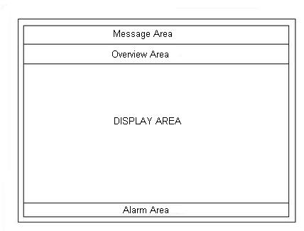

**What is Graphical User Interface (GUI)?**
Graphical User Interface is a live mimic which gives feel of an actual plant to the plant operator.
It provides the information of overview reports, process status reports, trend recording, historical data reports, production reports on a work station in the control room.
In case of PLC, SCADA software is necessary for development of GUI, where as in DCS in built Operator Interface is used for plant mimic displays.

The screen of the display is virtually divided in four parts
**Message area**, used for displaying the messages, alarms, faults and functional errors of the plant. **Overview area** contains the necessary information related to the status of the individual plant units to assist the operator in efficient plant monitoring.
**Main display area** gives the detailed representation of anything from process variable to plant unit as per selection by the operator.
**Operator's Instruction area** contains some standard and user-defined symbols plus some key words which assists the operator to view operating advices from the computer.

### **General Structure of Operator Display Screen**
Two types of displays available in DCS are: **Standard Displays** and **User defined Displays Standard displays**: Gives graphic, symbolic and alphanumeric information structured in standardized format based on the long experience of the plant engineers and operators. The displays are Plant **Overview Display, Unit or Area Overview Display, Group Display** and **Loop Display** as per the plant hierarchy. The higher level in the hierarchy has access to significant control parameters and alarms of lower levels. \
**Detailed Display displays** the values of relevant parameters with short-time records. \
**User - Defined Displays**, as the name suggests, are plant specific. There is no standard library or ready to use display structures available here. \
**Plant Mimic Diagrams** and **Batch Control Diagrams** are two features normally built by user. \
**Plant Mimic Diagrams, Area Mimic Diagrams** and **Group Mimic Diagrams** represent the hierarchy for the user defined displays. \
**Batch Control Diagrams** are used for planning, monitoring and carrying out of batch processes or of time and event-driven sequential processes. The execution of individual step can be seen in it.
Continuous monitoring of parameters on the displays demands for the presence of the operator. But there are parameters which are very critical. In case of abnormal situation, to attract the attention of user, there is a provision of the alarm banner at the bottom of the display. It displays the alarms as per the configuration. In order to distinguish between different alarms, they are assigned priorities and they are assigned different colors for identifying them.
Critical alarms are indicated by Red color, Warning alarms by Yellow color and Advisory by Purple color.
